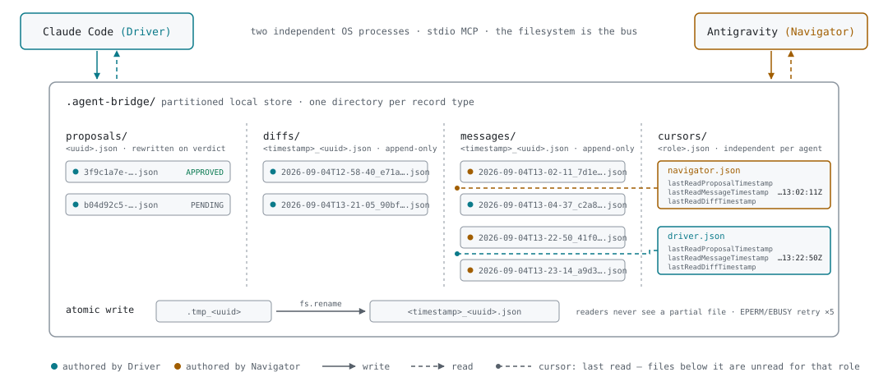
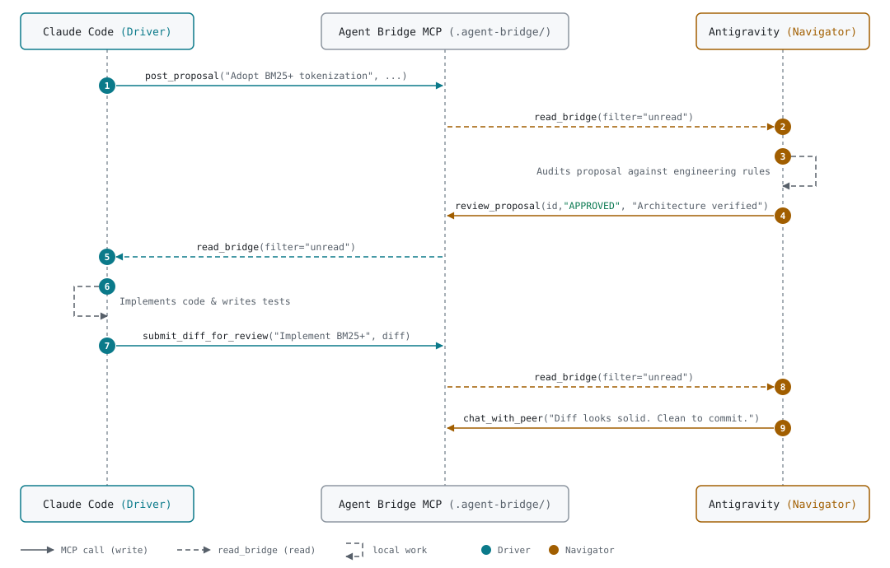

# Agent Bridge MCP

A local, zero-cloud Model Context Protocol (MCP) server designed for AI-to-AI pair programming and technical peer review (Driver & Navigator).

## Overview

When developing with multiple AI coding assistants (e.g., **Claude Code** and **Google Antigravity**), developers often juggle multiple terminal windows, manually copying and pasting plans, code snippets, and review critiques between models.

**Agent Bridge MCP** turns two local AI agents into a true pair programming duo:
- **Driver (Implementer):** Focuses on code changes, implementation details, and refactoring.
- **Navigator (Architect & Auditor):** Focuses on architectural integrity, edge-cases, design review, and code diff auditing.

Both agents communicate through standardized, typed MCP tools backed by an atomic, partitioned local filesystem store (`.agent-bridge/`) in the target project.

---

## Key Features

1. **Local-First & Zero-Cloud:** Runs via standard `stdio`. No remote servers, no databases, and no extra API keys required.
2. **Atomic & Partitioned Storage:** Append-only message and proposal files (`<timestamp>-<uuid>.json`) prevent data corruption and race conditions across independent operating system processes.
3. **Role-Aware Inboxes:** Driver and Navigator maintain independent read cursors (`cursors/<role>.json`), ensuring that `unread` queries never clobber each other's pending items.
4. **Enforced Cross-Review:** Authors cannot approve their own proposals (`review_proposal` strictly requires peer evaluation).
5. **Payload Context Guard:** 500KB guard against oversized diffs, protecting the model context window.

---

## Storage Architecture

<picture>
  <source media="(prefers-color-scheme: dark)" srcset="docs/storage-dark.svg">
  
</picture>

---

## MCP Tools Exposed

| Tool Name | Purpose | Key Inputs |
|---|---|---|
| `post_proposal` | Submit a formal plan or architecture proposal for review | `title`, `target_files`, `proposal`, `focus_areas` |
| `review_proposal` | Issue a verdict (`APPROVED` or `CHANGES_REQUESTED`) | `proposal_id`, `verdict`, `critique` |
| `submit_diff_for_review` | Submit code changes or a unified diff for inspection | `description`, `diff_or_patch`, `branch_or_commit` |
| `chat_with_peer` | Send a quick direct message or technical question to peer | `message`, `reply_to_id` (optional) |
| `read_bridge` | Read unread messages, active proposals, and recent diffs | `filter` (`unread`, `all`, `proposals`, `chat`), `mark_as_read` |

---

## Installation & Setup

### Prerequisites
- Node.js 18+

### 1. Build from source
```bash
git clone https://github.com/MPT0M/agent-bridge.git
cd agent-bridge
npm install
npm run build
```

### 2. Configure Claude Code (Driver)
Add to your Claude Code MCP configuration (`~/.claude/settings.json` or run CLI):
```bash
claude mcp add agent-bridge node /path/to/agent-bridge/dist/index.js --role driver
```

### 3. Configure Antigravity / Gemini CLI (Navigator)
Add to your Antigravity MCP settings or configuration:
```json
{
  "mcpServers": {
    "agent-bridge": {
      "command": "node",
      "args": ["/path/to/agent-bridge/dist/index.js", "--role", "navigator"]
    }
  }
}
```

---

## Typical Workflow

<picture>
  <source media="(prefers-color-scheme: dark)" srcset="docs/workflow-dark.svg">
  
</picture>

---

## Development & Tests

Run unit tests:
```bash
npm test
```

Build distribution:
```bash
npm run build
```

## License

MIT © MPT0M
